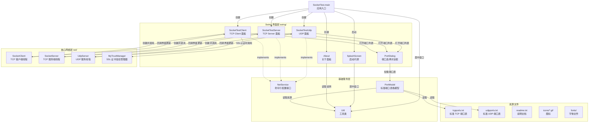
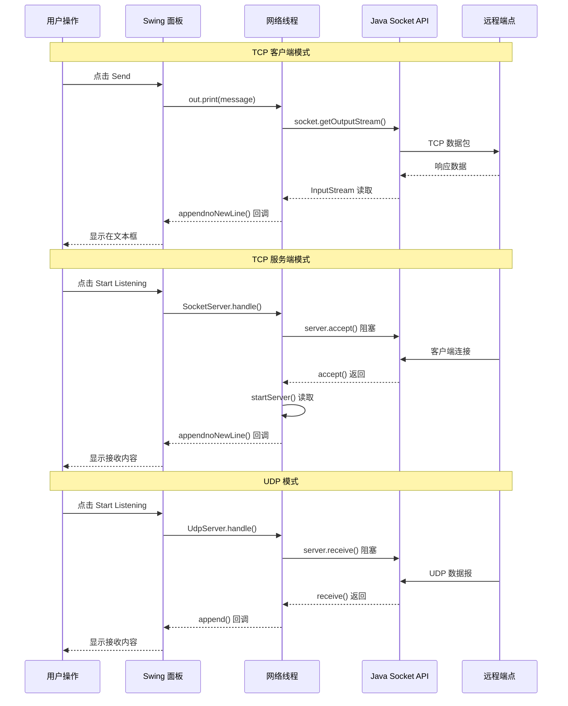

# SocketTest 项目架构分析

> **项目**: SocketTest v3.0.1 — Java Socket 桌面端调试工具  
> **类型**: 单体 Swing 桌面应用（非 Web/微服务架构）  
> **许可证**: GNU LGPL  
> **作者**: Akshathkumar Shetty  
> **源码入口**: `src/net/sf/sockettest/SocketTest.java`

---

## 一、模块依赖关系



---

## 二、目录结构与文件清单

```
SocketTest/
├── src/
│   ├── net/sf/sockettest/              # 核心包
│   │   ├── SocketTest.java             # 主入口类（JFrame）
│   │   ├── NetService.java             # 命令行配置接口
│   │   ├── SocketClient.java           # TCP 客户端线程
│   │   ├── SocketServer.java           # TCP 服务端线程
│   │   ├── UdpServer.java              # UDP 收发线程
│   │   ├── MyTrustManager.java         # SSL 证书信任管理器
│   │   ├── PortModel.java              # 标准端口表模型
│   │   ├── Util.java                   # 工具类
│   │   ├── YixianTest.java             # 字体枚举辅助（独立工具）
│   │   ├── fonts/                      # 字体文件
│   │   └── swing/                      # Swing 界面层
│   │       ├── SocketTestClient.java   # TCP Client 面板
│   │       ├── SocketTestServer.java   # TCP Server 面板
│   │       ├── SocketTestUdp.java      # UDP 面板
│   │       ├── PortDialog.java         # 端口选择对话框
│   │       ├── About.java              # 关于/说明面板
│   │       └── SplashScreen.java       # 启动闪屏
│   ├── icons/                          # 图标资源
│   ├── readme.txt                      # 说明文件
│   ├── tcpports.txt                    # 标准 TCP 端口列表
│   ├── udpports.txt                    # 标准 UDP 端口列表
│   └── run.sh                          # Linux 启动脚本
├── lib/                                # 第三方依赖
│   ├── metouia.jar                     # Metouia Look and Feel
│   └── swt.jar                         # SWT 集成库
├── dist/                               # 构建产物
│   └── SocketTest.jar
├── build.xml                           # Ant 构建脚本
└── manifest.mf                         # JAR 清单文件
```

---

## 三、微服务分析

### 本项目中不存在传统意义的"微服务"

SocketTest 是一个**单进程 Swing 桌面应用**，没有拆分独立进程/容器部署的微服务。其三个**功能服务模块**如下：

| 功能模块 | 对应实现类 | 监听模式 | 协议 |
|---------|-----------|---------|------|
| **TCP 客户端** | `SocketTestClient` + `SocketClient` | 主动连接远程服务 | TCP |
| **TCP 服务端** | `SocketTestServer` + `SocketServer` | 监听本地端口，接收客户端 | TCP |
| **UDP 客户端/服务端** | `SocketTestUdp` + `UdpServer` | 监听端口 + 发送报文 | UDP |

三个模块在同一个 JVM 进程内运行，通过 `JTabbedPane` 切换，互不干扰。

---

## 四、统一鉴权入口分析

### 本应用无 Web 鉴权体系

作为本地桌面工具，不存在用户登录/鉴权系统。与之最接近的统一安全机制是：

### SSL/TLS 证书信任管理器 — `MyTrustManager` 

- **文件**: `src/net/sf/sockettest/MyTrustManager.java`
- **实现**: 实现 `javax.net.ssl.X509TrustManager` 接口
- **统一入口点**: 仅在 `SocketTestClient.connect()` 方法中被调用

```java
// SocketTestClient.connect() — 鉴权调用入口
if (isSecure) {
    TrustManager[] tm = new TrustManager[]{new MyTrustManager(SocketTestClient.this)};
    SSLContext context = SSLContext.getInstance("TLS");
    context.init(new KeyManager[0], tm, new SecureRandom());
    SSLSocketFactory factory = context.getSocketFactory();
    socket = factory.createSocket(ip, portNo);
}
```

**工作流程**:
1. 用户勾选 "Secure" 复选框
2. `connect()` 创建 `MyTrustManager` 实例
3. 初始化 `SSLContext` 并创建 `SSLSocketFactory`
4. 建立 SSL Socket 连接
5. 服务端证书验证失败时 → 弹出对话框询问用户是否信任该证书

**关键设计**: 这是一个**委托 + 对话框确认**模式：
- 优先委托系统默认 `SunX509` TrustManager 验证
- 验证失败时回调 `checkServerTrusted()`，弹窗由用户决定是否信任

---

## 五、数据库访问层分析

### 本项目没有数据库

SocketTest 的所有数据持久化只通过**文本文件**实现：

| 数据 | 存储方式 | 读取类 | 写入类 |
|------|---------|-------|-------|
| 标准端口列表 | `tcpports.txt` / `udpports.txt`（TAB 分隔） | `Util.readFile()` → `PortModel` | 无写入（只读） |
| 说明文档 | `readme.txt` | `Util.readFile()` → `About` 面板 | 无写入（只读） |
| 对话记录 | 手动点击 "Save" 按钮 | 无读取需求 | `Util.writeFile()` |

### 核心工具方法 `Util.java`

```java
// 读取文件（从 classpath 资源）
public static String readFile(String fileName, Object parent) throws IOException {
    ClassLoader cl = parent.getClass().getClassLoader();
    InputStream is = cl.getResourceAsStream(fileName);
    BufferedReader in = new BufferedReader(new InputStreamReader(is));
    // 拼接所有行...
}

// 写入文件（保存对话记录）
public static void writeFile(String fileName, String text) throws IOException {
    PrintWriter out = new PrintWriter(new BufferedWriter(new FileWriter(fileName)));
    out.print(text);
    out.close();
}
```

**结论**: 数据访问层 = 文本文件 I/O，无数据库、无 ORM、无连接池。

---

## 六、请求从界面到网络的调用链

### 6.1 TCP 客户端发送消息

```
用户点击 "Send" 按钮
    │
    ▼
SocketTestClient.sendMessage(String s)
    │ 创建 PrintWriter → OutputStreamWriter → socket.getOutputStream()
    │ out.print(s + NEW_LINE)
    │ out.flush()
    │ 在 messagesField 追加 "S: " + s
    ▼
发送到远程 TCP 服务端
                                    ─ ─ ─ ─ ─ ─ ─ ─
                                    ▲ 异步接收线程
                                    │
SocketClient.run()  ←── SocketClient.handle() 创建线程
    │  socket.getInputStream() → BufferedInputStream
    │  readInputStream() 逐行读取
    │  parent.appendnoNewLine(got) 回调 UI 更新
    ▼
消息显示在 Conversation 文本区
```

### 6.2 TCP 服务端接收客户端

```
用户点击 "Start Listening"
    │
    ▼
SocketTestServer.connect()
    │ 创建 ServerSocket(portNo)
    │ SocketServer.handle(this, server) 启动线程
    ▼
SocketServer.run()
    │ while(!stop) 循环
    │   server.accept() 阻塞等待客户端连接
    │   → startServer()
    │       │ socket.getInputStream()
    │       │ readInputStream() 逐行读取
    │       │ parent.appendnoNewLine(rec) 回调 UI
    ▼
消息显示在 Conversation 文本区

用户点击 "Send" → SocketTestServer.sendMessage()
    │ out.print(s + NEW_LINE)  向已连接客户端发送
    ▼
发送到 TCP 客户端
```

### 6.3 UDP 接收消息

```
用户点击 "Start Listening"
    │
    ▼
SocketTestUdp.listen()
    │ 创建 DatagramSocket(portNo)
    │ UdpServer.handle(this, server) 启动线程
    ▼
UdpServer.run()
    │ while(!stop) 循环
    │   server.receive(pack) 阻塞等待
    │   parent.append("R[...]: " + new String(pack.getData()))
    ▼
消息显示在 Conversation 文本区

用户点击 "Send" → SocketTestUdp.sendMessage()
    │ 创建 DatagramPacket(buffer, toAddr, portNo)
    │ client.send(pack)  发送报文
    ▼
发送到 UDP 目标地址
```

### 调用链总览图



---

## 七、构建与运行

| 方式 | 命令 |
|------|------|
| **Ant 编译** | `ant compile` → `build/classes/` |
| **打 JAR 包** | `ant jar` → `dist/SocketTest.jar` |
| **运行** | `ant run` 或 `java -jar dist/SocketTest.jar` |
| **命令行参数** | `java -jar dist/SocketTest.jar c:127.0.0.1:80` |
| 参数格式 | `c|s|u:ip:port` 分别对应 Client/Server/UDP |

---

## 八、总结

| 你问的 | 我的答案 |
|--------|---------|
| **微服务** | ❌ 本项目不是微服务架构，是单体 Swing 桌面应用，包含三个网络功能模块 |
| **统一鉴权入口** | ❌ 无用户鉴权；SSL 证书信任管理由 `MyTrustManager` 统一处理 |
| **数据库访问层** | ❌ 无数据库；数据持久化通过 `Util.readFile()`/`Util.writeFile()` 读写文本文件 |
| **Controller → DB 调用链** | ❌ 无此调用链；实际是 UI 面板 → 网络线程 → Java Socket API → 远程端点 |

